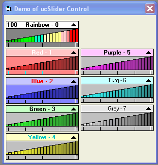



## A Slider usercontrol with Bars \( Update 2\)

### Description

A simple slider usercontrol with color bars, drop down style.Has several color properties,so you can make it to suit your needs.Hopefully someone will like it.Fairly small footprint.
 
### More Info
 

             |
---                |---
**Submitted On**   |2006-09-30 16:29:52
**By**             |[Kenneth Foster](https://github.com/Planet-Source-Code/PSCIndex/blob/master/ByAuthor/kenneth-foster.md)
**Level**          |Intermediate
**User Rating**    |4.9 (93 globes from 19 users)
**Compatibility**  |VB 6\.0
**Category**       |[Custom Controls/ Forms/  Menus](https://github.com/Planet-Source-Code/PSCIndex/blob/master/ByCategory/custom-controls-forms-menus__1-4.md)
**World**          |[Visual Basic](https://github.com/Planet-Source-Code/PSCIndex/blob/master/ByWorld/visual-basic.md)
**Archive File**   |[A\_Slider\_u2022549302006\.zip](https://github.com/Planet-Source-Code/kenneth-foster-a-slider-usercontrol-with-bars-update-2__1-66648/archive/master.zip)

